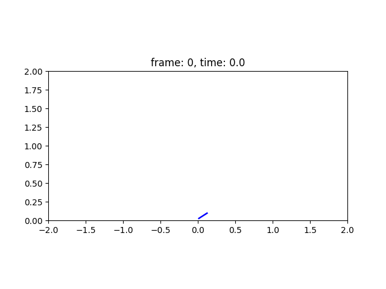
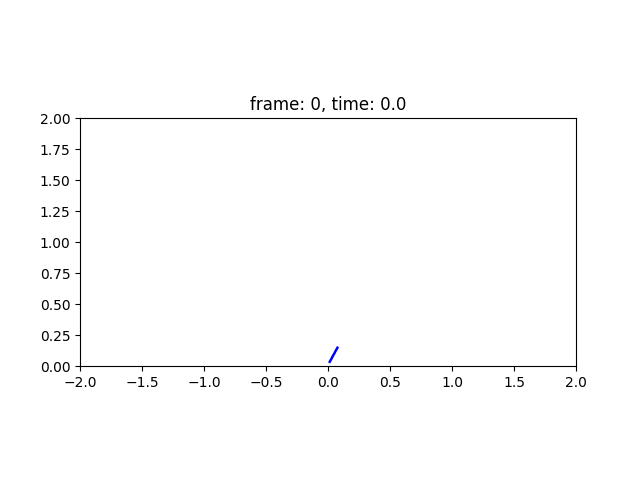

# Overview

This is a simulation and control systems project for a self-balancing robot. I simulate the robot's dynamics through numerical integration over time with SciPy and visualise the motion through matplotlib. I test out both PID and LQR control.

## Features

- LQR simulation for balancing robot
- PID simulation with torque and PWM outputs
- Arduino code for motor control
- Plotting and animation using Matplotlib

## Simulations
LQR Simulation:



PID Simulation:



## Requirements

- Python 3.x
- Packages:
  - numpy
  - scipy
  - matplotlib
  - control
- Arduino IDE

Install Python packages with:

```bash
python -m pip install -r requirements.txt
